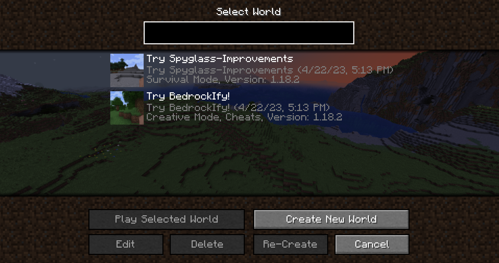
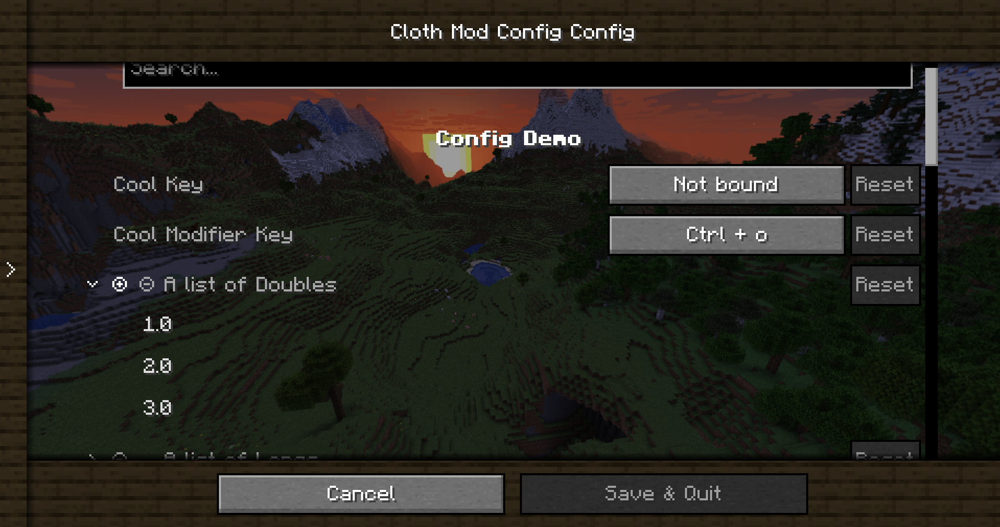
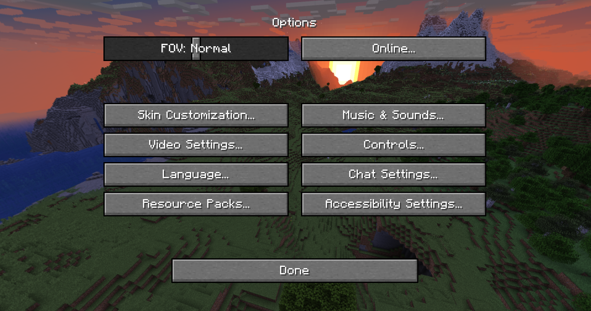

# Panorama Screens
Panorama Screens is a mod that enhances Minecraft screens by adding the title screen rotating panorama background. 

It is also compatible and tested with lots of mods and allows the player to manually add the panorama screen with untested mods.

## Features
- Screen allow list for compatible screens/mods.
- Screen block list for incompatible screens/mods.
- Configurable through Cloth Config.
- High compatibility with other mods.

## Screenshots




## Installation
### Forge
This mod requires [Forge](https://files.minecraftforge.net/). You can download Panorama Screens from the [CurseForge](https://www.curseforge.com/minecraft/mc-mods/panorama-screens) or [Modrinth](https://modrinth.com/mod/panorama-screens/), make sure to download the forge version.
- Install Forge.
- Drop the mod jar inside the mods folder.
- Optionally, download and install [Cloth Config](https://modrinth.com/mod/cloth-config) to be able to access the config menu.
- That's all!
### Fabric
This mod requires [Fabric](https://fabricmc.net/use/) and [Fabric API](https://www.curseforge.com/minecraft/mc-mods/fabric-api). You can download Panorama Screens from the [CurseForge](https://www.curseforge.com/minecraft/mc-mods/panorama-screens) or [Modrinth](https://modrinth.com/mod/panorama-screens/), make sure to download the fabric version.
- Install Fabric
- Place Fabric API jar inside the mods folder.
- Place Panorama Screens jar inside the mods folder.
- Success!

## Building from source:
Panorama-Screens screens can be built for both forge and fabric.
**Under Linux / macOS**
```shell script
git clone https://github.com/juancarloscp52/panorama-screens/
cd panorama-screens
./gradlew build
```
**Under Windows**
```shell script
git clone https://github.com/juancarloscp52/panorama-screens/
cd panorama-screens
gradlew build
```
You can find the built JARs inside panorama-screens/forge/build/libs and panorama-screens/fabric/build/libs
## License
Bedrockify is released under the free and open-source [GPL-3.0 License](LICENSE).